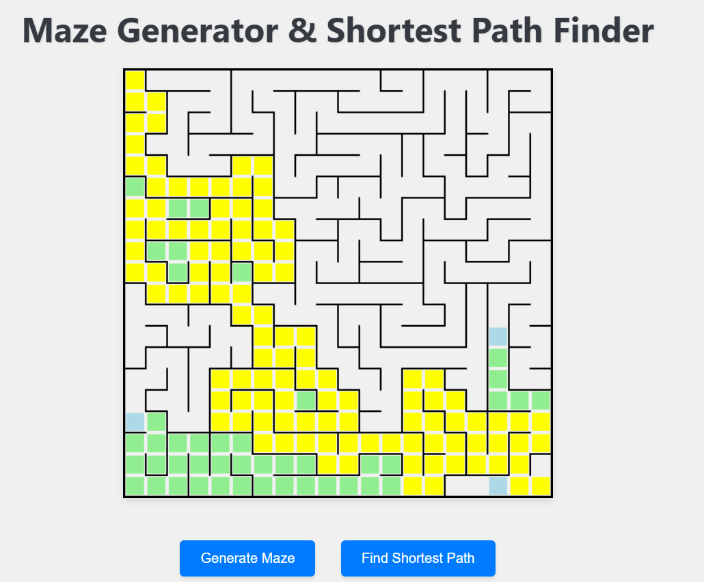

# Maze Generator with Pathfinding Visualization
This project is a Maze Generator and Pathfinding Visualizer built using HTML, CSS, and JavaScript. The maze is generated using the Depth-First Search (DFS) algorithm, and the shortest path is found using Breadth-First Search (BFS). Both processes are visualized in real-time for better understanding.

## Features

- **Maze Generation**: Generates a random maze using the DFS algorithm.
- **Pathfinding**: Visualizes the shortest path from start to end using BFS.
- **Smooth Animations**: Both maze generation and pathfinding processes are animated in real-time.
- **Start and End Points**: The starting point is marked in green, and the end point is marked in red.
- **Visualized Path**: The shortest path is highlighted in yellow.

## Demo



## How to Use

1. Clone this repository to your local machine.
    ```bash
    git clone https://github.com/faij1207/maze-generator.git
    ```

2. Navigate to the project folder.
    ```bash
    cd maze-generator
    ```

3. Open the `index.html` file in your web browser.

4. A maze will automatically start generating on the canvas, and once completed, the shortest path will be visualized.

## Project Structure

```
.
├── index.html       # Main HTML file
├── style.css        # Styling for the project
├── script.js        # Maze generation and pathfinding logic
├── src/             # Assets directory
│   └── demo.png     # Demo image
└── README.md        # Project documentation
```

## Technologies Used

- **HTML**: For structuring the application.
- **CSS**: For styling the UI.
- **JavaScript**: For implementing the maze generation and pathfinding algorithms.

## Algorithms Used

- **Maze Generation**: The Depth-First Search (DFS) algorithm is used to generate a random maze.
- **Shortest Path Finding**: The Breadth-First Search (BFS) algorithm is used to find the shortest path from the starting point to the exit.

## Future Improvements

- Add more algorithms (e.g., A*, Dijkstra) for pathfinding.
- Allow users to adjust the maze size and speed of visualization.
- Enable user interaction for selecting start and end points.

## License

This project is licensed under the MIT License. See the [LICENSE](./LICENSE) file for more details.

## Author

- **Faij Alam** - [GitHub](https://github.com/faij1207)